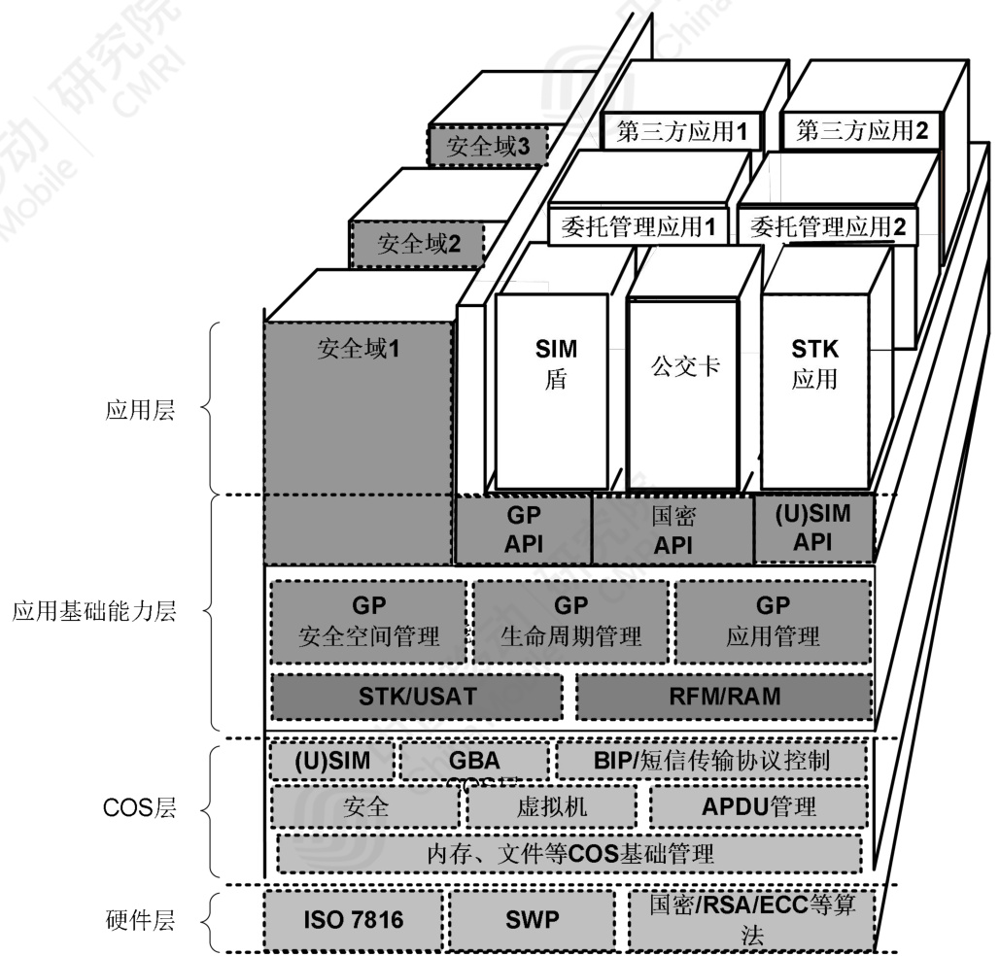

# 中国移动超级 SIM 卡技术白皮书（2020 年）  

中国移动研究院  

# 前 言  

SIM 卡是运营商认证用户身份的硬件载体，具有高等级的安全特性，是运营商与用户间的重要触点。  

自移动网络诞生以来，起初手机终端的业务仅有打电话、发短信，SIM 卡承担终端侧的入网认证，起到业务安全保障作用。随着通信网络、终端技术的不断演进，手机终端上的业务也演变为支持丰富多变的第三方业务，继而对 SIM 卡的需求也发生了变化，期望除电信功能外发挥更大的作用。GP 多应用和 NFC 技术的兴起，使得 SIM 卡技术不断革新，由单应用 Native 卡升级为多应用卡，在 ISO 7816 接口基础上增加了支持 NFC 功能的 SWP（单线协议）接口，同时提供用户应用空间与行业伙伴合作，SIM 卡发展为承载各类业务的高安全性优质容器。SIM 卡技术发展为业务合作带来无限可能，中国移动推出超级SIM 卡，希望为产业各方带来更为广阔的市场契机。  

本白皮书旨在明确中国移动对于个人领域 SIM 卡的发展方向、架构设计及能力要求，希望能够为产业在规划设计 SIM 卡相关技术、产品和解决方案时提供参考和指引。利用超级 SIM 卡空间开放能力，中国移动希望联合各行业合作伙伴探索高质量的 SIM 卡业务，提升 SIM卡价值，构建 SIM 卡业务生态体系，服务用户生活。  

本白皮书的版权归中国移动所有，未经授权，任何单位或个人不得复制或拷贝本建议之部分或全部内容。  

# 目 录  

1. 概述.. 2  
2. 技术架构.. .5  
3. 技术要求.. .6  
3.1 硬件层.. 6  
3.1.1 芯片安全要求. .6  
3.1.2 物理电气特性. ..6  
3.1.3 终端与卡通信接口.. 6  
3.1.4 擦写寿命要求. 7  
3.2 COS 层技术要求.. 7  
3.2.1 基础电信功能. 7  
3.2.2 5G 新增功能. 7  
3.2.3 GBA 认证.... .8  
3.2.4 BIP 协议.... .8  
3.2.5 多物理通道.. .8  
3.2.6 多逻辑通道.. ..9  
3.2.7 密码算法性能. ..9  
3.3 应用基础能力层技术要求.. 11  
3.3.1 GP 多应用管理技术. .. 11  
3.3.2 API... ..11  
3.3.3 国密算法. ..11  
3.3.4 RAM/RFM 技术. ...12  
3.3.5 客户端访问 SIM 卡的安全控制机制. .. 12  
3.3.6 用户空间. ..12  
3.4 预置应用.. 13  
3.4.1 SIM 快捷确认. ....13  
3.4.2 SIM 盾... .....13  
3.4.3 白卡写卡. ..13  
4. 结束语.. ...14  
缩略语列表. ....15  
参考文献... ..16  

# 1. 概述  

2020 年是 5G 加速发展的发力年，根据国家“加快 5G 网络等新型基础设施建设，积极丰富 5G 技术应用场景”战略部署，中国移动将对 5G 通信网络进行全面升级，夯实经济数字化转型基础，不断丰富 5G 应用场景，拓展信息消费的新业态、新模式。5G 支持 eMBB（增强移动宽带）、mMTC(海量机器类通信)和 uRLLC(超可靠、低时延通信)三大典型应用场景，从人与人通信延伸到人与物、物与物的连接，真正实现了“万物互联”。所有联网设备都需要通过 SIM 卡完成认证，对SIM 卡提出了更高的安全要求和功能要求。  

本次中国移动推出的超级 SIM 卡，首先在 4G 基础上针对 3GPP 5G 标准中定义的新功能和新文件进行了全面升级。超级 SIM 卡新增加了用户身份隐私保护能力，采用国际高安全算法对用户标识（SUPI）进行加密得到 SUCI，避免了 5G 用户身份标识在空口被截获，降低了个人隐私数据被收集的风险。超级 SIM 卡引入了 3GPP 5G 标准中升级的设备移动性管理功能，利用 SIM 卡内置的位置信息、安全上下文文件，记录 5G 设备的位置信息和驻网信息，提升了设备的二次驻网速度。 超级 SIM 卡引入 5G 接入控制功能，通过卡内文件配置可实现签约用户对多媒体服务和关键事务服务接入类型的优先级控制，满足用户的不同类别的通信业务需求。通过使用 UE 路由选择策略服务，卡内可存储默认切片配置相关信息，为用户享受运营商提供的 5G 基础切片服务提供支撑。  

其次除提供基础 4G/5G 电信服务外，超级 SIM 卡还可凭借高安全、开放性特点发挥更大作用，赋能千行百业。超级 SIM 卡的典型应用场景包括三类：  

一是 NFC 刷卡。NFC 技术具有交易速度快、安全性高的优势，支持双离线场景（刷卡交易双方的设备均处于离网状态）。线下“刷”卡也是用户感知 SIM 卡的最佳场景，中国移动已拓展的刷卡类业务涵盖政务、金融、交通、校企等领域。超级 SIM 还可“装载”居民身份证件，用户刷手机即可办理酒店入住、高铁出行等手续。其它线下刷卡场景（如：小区/企业门禁、车钥匙等），也都可用超级 SIM 卡取代传统实体卡。  

二是认证服务。基于 SIM 卡的鉴权密钥，3GPP 定义了一种通用认证机制——GBA，以一种一致的方式为各类业务 APP 提供设备标识和差异化密钥服务，GBA 技术已在 eSIM 一号双终端业务和 5G 消息业务中使用。超级SIM 卡除了为移动终端 APP 提供 GBA_U 功能（APP 可以调用 GBA_U 功能协商密钥、保护交易）外，还定义了专用的 API 供卡片 APPLET 调用。  

三是安全保障服务。超级 SIM 卡作为终端侧的高可信硬件，还可用于存储 APP 业务密钥和敏感数据（如：用户隐私数据、钱包余额等），并提供加、解密服务，相当于终端中的“保险箱”和“加密机”。以区块链技术为例，用户标识是一系列的公、私钥对，交易发起方通过自己地址（公钥）对应的私钥发起交易，交易接收方提供地址接收信息，并使用发起方公钥验证其身份，超级 SIM 卡可提供用户侧公私钥生成、存储、运算等服务，极大提升了“交易”的安全性和抗抵赖性。  

超级 SIM 卡还为行业合作伙伴提供了灵活的应用管理模式及丰富的应用交易服务：  

$\spadesuit$ GP 标准应用管理服务。中国移动多应用管理（TSM）平台是超级 SIM 卡的全网统一业务管理平台，负责对超级 SIM 卡空间、密钥及应用接入进行统一管理。TSM 平台为应用合作方提供独立辅助安全域，合作方可通过自有渠道开展应用的业务推广和管理。  
$\spadesuit$ 卡应用安全运行环境。芯片通过 EAL4+以上（含）安全认证，通过 EMVCo安全认证(或通过银联芯片卡集成电路安全测试)，通过国密二级以上（含）认证。  
$\spadesuit$ 统一、高效的密码算法服务。超级 SIM 卡支持 RSA、ECC、3DES、AES、国密(SM2、SM3、SM4)等算法，对各类密码算法作了统一性能要求，大幅度提升了密码算法的执行速度。  
$\spadesuit$ 全面的机卡通信接口。为解决 iPhone 及部分安卓手机“机卡通道不通”的难题，超级 SIM 卡升级机卡接口支持 BIP 协议，提供在远程平台和 SIM卡之间建立 IP 通路的能力。结合原有机卡通道，超级 SIM 卡可为终端APP 和业务平台提供短信、本地机卡接口、BIP 及 NFC 四大接口能力，满足各类线上、线下交易场景。  
$\spadesuit$ 功能丰富的 API。支持 GP API、SIM API、USIM API、UICC API、HCI API  

等，开放应用个人化、安全服务、SIM 文件及主动式命令等能力，供上层应用调用。  

最后超级 SIM 卡预置了中国移动自有应用提供各类服务。SIM 快捷确认应用可实现 PC、WAP、APP、H5 等场景下的用户快捷登录，以及业务审批等二次确认场景下的认证功能。SIM 盾应用替代传统 U 盾，在 SIM 卡安全芯片中存储多张个人数字证书，为金融行业、政府、企业办公提供高安全认证服务，已与中国银行、浦发银行开展商业合作。另外，超级 SIM 卡还支持白卡写卡服务，用户通过手机APP 即可足不出户、自助完成新开卡和补换卡服务。  

# 2. 技术架构  

中国移动超级SIM卡技术架构如图2-1所示，包括：硬件层、COS层、应用基础能力层和应用层四部分。  

  
图 2-1 中国移动超级 SIM 卡技术架构  

硬件层：定义SIM卡物理层访问接口，IO、CPU、存储器、协处理器等。  

COS层：主要定义SIM卡内存管理和文件系统等基础处理、各类安全机制、SIM/USIM逻辑功能、空中短信传输协议控制等。  

应用基础能力层：主要定义GP应用管理，实现应用程序提供在卡内下载、安装、删除的管理和存储等服务，并实现用户卡与外部设备通信的指令报文，以及包含鉴权和加密机制的安全信道会话机制；定义安全空间管理，在卡内划分不同的安全区域以承载不同的行业应用；定义应用和安全域的生命周期管理，提供各类API供上层应用调用。  

应用层：主要承载各类应用，包含各类行业应用（如公交、金融、校企等）及中国移动自有应用（SIM 盾、SIM 快捷确认等），应用可预置也可动态加载。  

# 3. 技术要求  

# 3.1 硬件层  

# 3.1.1 芯片安全要求  

芯片通过 EAL4+以上（含）安全认证，通过 EMVCo 安全认证(或通过银联芯片卡集成电路安全测试)，通过国密二级以上（含）认证。  

# 3.1.2 物理电气特性  

物理特性、电气特性遵循 ETSI 102.221 的要求。其中针对 SIM 卡和 CLF 芯片的接口电压，应保证至少支持 Class B 和 C。  

# 3.1.3 终端与卡通信接口  

通信接口指的是 SIM 卡与外部终端设备进行通信的接口，应支持 ISO7816和 SWP 两种接口。  

ISO7816 接口是 SIM 卡与外部终端设备进行通信的接触式 I/O 接口，遵循ETSI 102.221 的要求。  

SWP 接口是 SIM 卡与外部非接触终端设备进行通信，实现近场通信相关业务的物理接口。超级 SIM 卡支持 SWP 协议，遵循 ETSI TS 102.613 的要求。支持卡模拟模式、读卡器模式，可选支持点对点传输模式。 G  

移动终端若支持 NFC 功能，则应支持 SWP 接口，与超级 SIM 卡协同实现刷卡操作，为用户提供基于非接触感应的线下应用场景。  

# 3.1.4 擦写寿命要求  

超级 SIM 卡能保证 10 万次的擦写次数，对于高频更新文件（如 LOCI、会话密钥文件等）能保证 50 万次的擦写次数。 公  

# 3.2 COS 层技术要求  

# 3.2.1 基础电信功能  

超级 SIM 卡采用 UICC 多应用架构要求，同时支持 SIM 和 USIM 功能，符合 3GPPTS 31.101 和 31.102 要求，同一时刻只能有一个应用处于激活状态。  

支持 USAT/STK 指令及功能，符合 3GPP TS 31.111/11.14 要求。STK 或 USAT也称为“SIM 卡应用工具箱”，是在原 SIM 卡或 USIM 卡被动式的操作系统上，衍生出的 SIM 卡或 USIM 卡主动交互式的操作系统。该机制允许 SIM 卡中的应用与支持该应用的终端进行交互操作，即支持 SIM 卡与 ME 之间的主动式对话，从而使移动用户拥有个人化附加业务。  

超级 SIM 卡增强速率至少支持(F,D) $=$ (512,32) ，(512,16) ,(512,8)和(372,1)，建议手机终端至少支持到(F,D) $=$ (512,32)速率，这样可保证机卡接口工作在高速率状态，提升数据传输速度。  

# 3.2.2 5G 新增功能  

5G 功能是遵照 3GPP 规范定义的用户身份隐私保护、5G 移动性管理、5G 接入控制、网络安全认证密钥存储等功能。  

5G 对用户身份（SUPI）引入安全保护，即通过 SIM 卡中的归属网络公钥对SUPI 进行加密生成密文 SUCI，防止用户身份在空口明文传输发生信息泄露。超级 SIM 卡支持 Profile A、Profile B 及 null scheme 三种保护方案，且支持 GETIDENTITY 指令，终端可向 SIM 卡发送该指令获取用户身份的密文 SUCI 进而传送给网络进行用户身份认证。  

开启 5G 移动性管理服务，终端在驻网成功后可向 SIM 卡内写入 5G-GUTI、上次访问 TAI 及状态更新、NAS 的上下文等信息，后续终端可使用该信息作为依  

据快速驻网。  

开启 5G 接入控制服务，可通过在 5G 卡内设置接入优先级控制 MPS（Multimedia priority service）/MCS（Mission critical service）服务的接入，满足不同场景下服务需求。  

超级 SIM 卡还提供鉴权派生密钥 KAUSF、KSEAF 等的存储，供终端进行查询和更新。  

# 3.2.3 GBA 认证  

GBA 认证是 3GPP 定义的一种基于运营商通信网络的安全基础设施，可以为应用层业务提供统一的安全认证服务。  

超级 SIM 卡支持通用 GBA 认证功能,符合 3GPP TS 33.220 和 31.102 要求;扩展支持基于 GBA 密钥的安全服务接口,可为业务建立“端-云”安全通道,支持业务各种安全需求。 G  

除为移动终端 APP 提供 GBA_U 功能外，超级 SIM 卡还定义了专用的 API 供卡上 APPLET 调用，卡片 APPLET 亦可借助超级 SIM 卡的 GBA 功能完成密钥和数据的个人化。  

# 3.2.4 BIP 协议  

BIP 协议是承载无关协议，是 3GPP TS 31. 111 中提出的一种面向连接的传输协议。协议支持 GSM、CDMA、UMTS、NG-RAN 等移动网络，使用 Open Channel,Close Channel, Send Data, Receive Data, Get Channel Status 等主动式命令和 Data Available, Channel Status 等事件，允许 SIM 卡和服务器建立基于IP 的数据连接。超级 SIM 卡支持基于 BIP 的 HTTPS 协议。  

为满足基于 BIP 协议的大数据量传输场景，手机终端需能正确响应 SIM 卡的BIP 请求。 物  

# 3.2.5 多物理通道  

支持 SWP 接口和 ISO7816 接口，可判断指令来自 SWP 接口还是 ISO7816 接口。  

可保证对接触式应用和非接触应用处理间互不影响。在混合模式下(接触式应用和非接触应用同时支持)的状态可以自动切换，保证卡片在状态切换前后不会导致非接触和接触应用的状态丢失。  

支持应用优先级管理功能，正常的移动通讯功能不会导致非接触交易的失败，同时非接触交易的操作也不应导致通讯功能的失败。  

# 3.2.6 多逻辑通道  

支持 $4^{\sim}20$ 个逻辑通道，由 SIM 卡来决定使用的逻辑通道，通过 ManageChannel 指令的响应通知外部设备相关逻辑通道号。USIM 应用是终端开机后基本逻辑信道上缺省选择的应用。对于不同逻辑通道的访问完全独立，相互没有影响。支持 MultiSelectable Interface，即一个具有 MultiSelectable 属性的应用实例在某个逻辑通道被选择时，同一个应用实例或同一包内另外一个应用实例可以在另外一个逻辑通道激活使用。此机制也适用于安全域。 G  

# 3.2.7 密码算法性能  

超级 SIM 卡全面支持国内、国际各类密码算法，包括 SM2、SM3、SM4、RSA、ECC、3DES、AES 等，为了满足 SIM 卡业务的发展需求，为各行业合作伙伴提供优质的能力服务，超级 SIM 卡对各类密码算法提出性能要求，具体见表 3-1 所示。  

表3-1 算法性能要求  

<html><body><table><tr><td>测试项</td><td>使用方法</td><td>输入长度 (字节)</td><td>说明 (ms/3000次平均时间）</td><td>标准值/ms</td></tr><tr><td rowspan="5">SM2</td><td>SM2_genSM2KeyPair_Time_Test01</td><td></td><td>SM2密钥对生成</td><td>32</td></tr><tr><td>SM2_Sign_Time_Test01</td><td>64</td><td>SM2签名</td><td>15</td></tr><tr><td>SM2_Verify_Time_Test01</td><td>128</td><td>SM2验签</td><td>18</td></tr><tr><td>SM2_Encrypt_Time_Test01</td><td>150</td><td>SM2加密</td><td>39</td></tr><tr><td>SM2_Decrypt_Time_Test01</td><td>246</td><td>SM2解密</td><td>30</td></tr><tr><td rowspan="4">RSA1024</td><td>RSA1024_genKeyPair_Time_Test01</td><td></td><td>RSA1024生成密钥对</td><td>757</td></tr><tr><td>RSA1024_Sign_Time_Test01</td><td>32</td><td>RSA1024签名</td><td>50</td></tr><tr><td>RSA1024_Verify_Time_Test01</td><td>160</td><td>RSA1024验签</td><td>9</td></tr><tr><td>RSA1024_Encrypt_Time_Test01</td><td>128</td><td>RSA1024加密</td><td>11</td></tr></table></body></html>  

<html><body><table><tr><td rowspan="5"></td><td>RSA1024_Decrypt_Time_Test01</td><td>128</td><td>RSA1024解密</td><td>50</td></tr><tr><td>RSA1024_CRT_genKeyPair_Time_Test01</td><td></td><td>CRT模式RSA1024生成密钥对</td><td>765</td></tr><tr><td>RSA1024_CRT_Sign_Time_Test01</td><td>20</td><td>CRT模式RSA1024签名</td><td>24</td></tr><tr><td>RSA1024_CRT_Decrypt_Time_Test01</td><td>128</td><td>CRT 模式 RSA1024解密</td><td>23</td></tr><tr><td>RSA2048_genKeyPair_Time_Test01</td><td></td><td>RSA2048生成密钥对</td><td></td></tr><tr><td rowspan="8">RSA2048</td><td></td><td></td><td></td><td>4653</td></tr><tr><td>RSA2048_Sign_Time_Test01</td><td>32</td><td>RSA2048签名</td><td>281</td></tr><tr><td>RSA2048_Verify_Time_Test01 RSA2048_Encrypt_Time_Test01</td><td>32 256</td><td>RSA2048验签 RSA2048加密</td><td>47</td></tr><tr><td>RSA2048_Decrypt_Time_Test01</td><td>256</td><td>RSA2048解密</td><td>18</td></tr><tr><td></td><td></td><td></td><td>277</td></tr><tr><td>RSA2048_CRT_genKeyPair_Time_Test01</td><td></td><td>CRT模式2048生成密钥对</td><td>4433</td></tr><tr><td>RSA2048_CRT_Sign_Time_Test01 RSA2048_CRT_Decrypt_Time_Test01</td><td>32</td><td>CRT模式2048签名 CRT模式2048解密</td><td>78</td></tr><tr><td></td><td>256</td><td></td><td>78</td></tr><tr><td>SM3</td><td>SM3_Time_Test01</td><td>256</td><td>SM3算法</td><td>7</td></tr><tr><td rowspan="6">SHA-256 3DES</td><td>SHA256_Time_Test01</td><td>256</td><td>SHA 2 256算法</td><td>7</td></tr><tr><td>DES_CBC_Encrypt_Time_Test01</td><td>256</td><td>3DES CBC 加密</td><td>21</td></tr><tr><td>DES_CBC_Decrypt_Time_Test01</td><td>256</td><td>3DES CBC解密</td><td>21</td></tr><tr><td>DES_ECB_Encrypt_Time_Test01</td><td>256</td><td>3DES ECB 加密</td><td>20</td></tr><tr><td>DES_ECB_Decrypt_Time_Test01</td><td>256</td><td>3DES ECB 解密</td><td>20</td></tr><tr><td>AES_128_CBC_Encrypt_Time_Test01</td><td>256</td><td>AES 128 CBC加密</td><td>18</td></tr><tr><td>AES</td><td>AES_128_CBC_Decrypt_Time_Test01</td><td>256</td><td>AES 128CBC解密</td><td>18</td></tr><tr><td rowspan="4"></td><td>AES_128_ECB_Encrypt_Time_Test01</td><td>256</td><td>AES 128 ECB加密</td><td>18</td></tr><tr><td>AES_128_ECB_Decrypt_Time_Test01</td><td>256</td><td>AES 128 ECB 解密</td><td>18</td></tr><tr><td>SM4_CBC_Encrypt_Time_Test01</td><td>256</td><td>SM4 CBC加密</td><td>19</td></tr><tr><td>SM4_CBC_Decrypt_Time_Test01</td><td>256</td><td>SM4 CBC解密</td><td>19</td></tr><tr><td rowspan="3">SM4 BIP建立</td><td>SM4_ECB_Encrypt_Time_Test01 SM4_ECB_Decrypt_Time_Test01</td><td>256</td><td>SM4 ECB加密</td><td>18</td></tr><tr><td></td><td>256</td><td>SM4 ECB 解密</td><td>18 451</td></tr><tr><td>Profile A</td><td></td><td></td><td>29</td></tr><tr><td rowspan="2">连接 SUCI计算</td><td></td><td></td><td></td><td></td></tr><tr><td>Profile B</td><td></td><td></td><td>32</td></tr></table></body></html>  

# 3.3 应用基础能力层技术要求  

# 3.3.1 GP 多应用管理技术  

传统智能卡应用最广泛的模式是在一个封闭的环境中为用户提供单一类型的应用，这很大地限制了用户可获得服务的多样性和潜在的增值服务空间。GP提出了跨行业的支持多安全域多应用的 SIM 卡架构以及相应的管理技术，使得运营商可以灵活地管理运营商自身以及商业合作伙伴运行在卡内的应用。  

超级 SIM 卡应支持 GP 功能，遵循《GlobalPlatform Card SpecificationVersion 2.2.1 》、 《 GlobalPlatform Card Specification Version 2.2,Amendment C: Contactless Services Version 1.0.1》、《GlobalPlatform CardUICC Configuration V1.0.1》、《GlobalPlatform Card UICC Configuration -Contactless Extension V1.0》要求。  

超级 SIM 卡在各种安全通道（SCP02、SCP80、SCP81 等）的使用中，均禁止单 DES 算法的使用（Single DES Plus Final Triple DES MAC across 除外）。  

# 3.3.2 API  

超级 SIM 卡支持 GP API、SIM API、USIM API、UICC API、HCI API 供上层应用调用。  

SIM 、UICC 及 USIM API：提供访问 SIM、UICC、USIM 的文件系统接口，提供将应用注册到 SIM 卡应用工具箱的接口以及发送主动式命令的接口。  

GP API: 为应用提供服务，包括持卡人验证、应用个人化或安全服务等。还可为应用提供卡内容管理服务，包括卡锁定、应用生命周期状态更新等。  

HCI API：为非接触应用提供 HCI 协议相关的服务接  

# 3.3.3 国密算法  

国密算法是国家密码局制定标准的一系列算法，包括对称加密算法，椭圆曲线非对称加密算法，杂凑算法。为落实网络强国战略，可充分利用 SIM 卡硬件加密的物理特性，建设国家级的安全基础设施，超级 SIM 卡支持国密算法，通过  

API 方式供上层应用调用。  

# 3.3.4 RAM/RFM 技术  

RAM(远程应用管理)指通过 SMS 数据短信、HTTPS 等传输协议以空中方式对SIM 卡中的安全域及应用进行远程卡内容管理，包括安全域创建、安全域个人化、应用下载、应用安装、应用个人化、应用删除等。  

RFM(远程文件管理)指通过 SMS 数据短信、HTTPS 等传输协议以空中方式对SIM 卡中文件系统进行远程管理，包括文件创建、文件读写、文件激活/去激活，文件大小调整、文件删除等。  

超级 SIM 卡支持 RAM 和 RFM 功能，符合 3GPP TS 31.116 要求。  

# 3.3.5 客户端访问 SIM 卡的安全控制机制  

SIM 卡安全控制是为了是阻止客户端对 SIM 卡中资源的非授权访问，同时可以防止针对 SIM 卡的拒绝服务攻击。SIM 卡是访问控制规则文件的存储介质。  

超级SIM 卡支持客户端访问USIM 卡的安全控制机制，在SIM 卡内通过Applet方式实现安全控制相关 PKCS#15 文件，并支持文件相关的读写操作。  

客户端与 SIM 卡应用之间的通讯需要通过手机终端操作系统提供 OpenMobile API 接口实现，同时手机终端还应支持访问控制机制，在开机过程中从SIM 卡内获取访问控制规则，进而实现对手机 APP 调用 SIM 卡的授权访问。  

# 3.3.6 用户空间  

用户可用的应用存储空间至少 500K 字节，供下载卡应用及保存应用个人化数据（如：密钥等）。 G  

用户可用 RAM 空间至少为 15.5K 字节。  

# 3.4 预置应用  

# 3.4.1 SIM 快捷确认  

SIM 快捷确认是使用超级 SIM 卡的用户身份认证能力，作为统一认证业务的一种认证方式，可实现以手机号为账号的 PC 端（wap 端）、APP 端、H5、短信链接等场景下的快捷登录，以及业务审批、授权等二次确认场景下的认证功能。  

# 3.4.2 SIM 盾  

SIM 盾（移动签名）应用加载在超级 SIM 卡上，向外提供安全存储能力和运算处理能力,可保存用户私钥和用户证书信息，可执行公私钥生成、RSA 加解密运算、签名/验签、Hash 运算等操作，对业务应用所使用的证书进行独立管理。  

SIM 盾（移动签名）是统一认证业务的一种认证方式，可为中国移动自有业务或第三方业务应用（如银行、政券）提供数字签名认证能力。  

# 3.4.3 白卡写卡  

白卡写卡是中国移动定义的自助便捷写卡应用。使用白卡写卡业务，用户可通过终端 APP 自助完成选号码、选套餐、实名认证、写卡、开户等操作，极大提高了用户入网的便携性和用户体验。  

# 4. 结束语  

技术革新往往会催生新的事物，带来新的发展契机。超级SIM卡作为中国移动最新一代的SIM卡产品，实现了5G新特性，在安全能力和机卡接口上全面升级，对各类国内、国际密码算法性能进行了全面提升，通过空间开放和多应用安全隔离将SIM卡能力全面开放，助力各行各业的数字化转型。  

中国移动希望携手产业链不断完善超级SIM卡的关键技术与功能，进一步提升机卡接口速率突破现有瓶颈，扩大容量承载更多应用，设计SIM卡和云的结合方案实现SIM卡能力云化等，向产业提供更加优质的SIM卡产品。同时希望以超级SIM卡为载体，为产业各方提供更加广阔的市场契机。联合各行各业加快SIM应用产品创新，丰富应用场景，逐步将传统的银行卡、公交卡、一卡通（政府、企业、社区、校园等）、门禁、身份证、货币、U盾、车钥匙等功能与SIM卡结合，构建SIM卡业务生态体系，利用SIM卡渗透到用户生活的方方面面，提供便捷、全方位的服务，将SIM卡打造为服务社会的基础设施，不断满足人民日益增长的美好生活需要。  

# 缩略语列表  

<html><body><table><tr><td>缩略语</td><td>英文全名</td><td>中文解释</td></tr><tr><td>3DES</td><td>Triple Data Encryption Algorithm</td><td>三重数据加密算法</td></tr><tr><td>AES</td><td>Advanced Encryption Standard</td><td>高级加密算法</td></tr><tr><td>API</td><td>Application Programming Interface</td><td>应用程序接口</td></tr><tr><td>BIP</td><td>Bearer Independent Protoco</td><td>承载无关的协议</td></tr><tr><td>SOO</td><td>Chip OS</td><td>芯片操作系统</td></tr><tr><td>ECC</td><td>Elliptic curve cryptography</td><td>椭圆加密算法</td></tr><tr><td>GBA</td><td>Generic Bootstrapping Architecture</td><td>通用引导架构</td></tr><tr><td>GP</td><td>GlobalPlatform</td><td>通用基础架构</td></tr><tr><td>UICC</td><td>Universal Integrated Circuit Card</td><td>通用集成电路卡</td></tr><tr><td>USAT</td><td>USIM Application Toolkit</td><td>USIM应用工具包</td></tr><tr><td>USIM</td><td>Universal Subscriber Identity Module</td><td>通用用户识别模块</td></tr><tr><td>RAM</td><td>Remote Application Management</td><td>远程应用管理</td></tr><tr><td>RFM</td><td>Remote File Management</td><td>远程文件管理</td></tr><tr><td>RSA</td><td>Rivest / Shamir / Adleman asymmetric</td><td>Rivest / Shamir / Adleman</td></tr><tr><td>SCP</td><td>algorithm Secure Channel Protocol</td><td>非对称算法 安全信道协议</td></tr><tr><td>SIM</td><td>Subscriber Identifier Module</td><td>移动网络用户身份模块</td></tr><tr><td>STK</td><td>SIM Toolkit</td><td>SIM卡应用交互机卡协议</td></tr><tr><td>SWP</td><td>Single Wire Protocol</td><td>单线通信协议</td></tr></table></body></html>  

# 参考文献  

[1] 3GPP TS 11.14，Digital cellular telecommunications system (Phase $2+$ )； Specification of the SIM Application Toolkit for theSubscriber Identity Module - Mobile Equipment(SIM - ME) interface.   
[2] 3GPP TS 31.102, Characteristics of the Universal Subscriber Identity Module (USIM) application.   
[3] 3GPP TS 31.111 ， Universal Subscriber Identity Module (USIM) Application Toolkit (USAT).   
[4] ETSI TS 102 221，Smart Cards:UICC-Terminal interface;Physical and logical characteristics.   
[5] ETSI TS 102 613，Smart cards: UICC-CLF interface; Physical and logical characteristics (SWP Specification).   
[6] 3GPP TS 11.14, Digital cellular telecommunications system (Phase $2+$ )； Specification of the SIM Application Toolkit for theSubscriber Identity Module - Mobile Equipment(SIM - ME) interface.   
[7] GP V2.2.1，GlobalPlatform Card Specification.   
[8] GP V2.2.1 – C,GlobalPlatform Card Specification Version 2.2, Amendment C: Contactless Services Version 1.0.1.   
[9] GP V2.2.1 – UICC,GlobalPlatform Card UICC Configuration V1.0.1,GlobalPlatform Card UICC Configuration - Contactless Extension V1.0.   
[10] 3GPP TS 33.220, Generic Authentication Architecture (GAA);Generic Bootstrapping Architecture (GBA).  