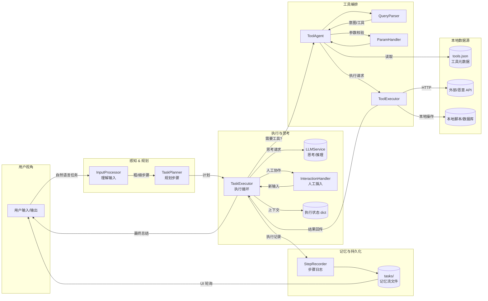

# Offline OmniWorker Agent

本仓库整理了一个可离线运行的通用 Agent 演示环境。核心目标是：

* 通过精简目录与删除冗余实验代码，使代理的主体逻辑清晰可维护；
* 使用可离线工作的 `LLMService` 桩件保持规划、执行链条的可用性；
* 保留针对间接提示注入的攻击样例，方便复现实验。 【F:OmniWorker/src/services/llm_service.py†L47-L200】

## 目录结构

```
OmniWorker/                 # 代理的核心逻辑
├── src/core/               # 输入处理、规划、执行、记录等模块
├── src/services/           # LLM 抽象（默认离线桩）
AIToolsBridge/              # 工具编排与参数解析框架
├── ToolsHub/ToolData/      # 工具元数据（含攻击用 API）
├── ToolsExecute/           # 调度本地脚本 / API 的执行器
api_demo/                   # 含恶意 payload 的示例 API 服务
attack_demo.py              # 端到端攻击演示脚本
app.py                      # Gradio Web UI（异步执行 + 日志轮询）
docs/agent_architecture.md  # 更详细的架构说明
requirements.txt            # 运行所需 Python 依赖
```

### 核心模块说明

- **输入理解 – `InputProcessor`**：两次调用 LLM，先生成粗粒度步骤再细化为连续编号的中文行动列表，同时兜底处理异常 JSON。【F:OmniWorker/src/core/input_processor.py†L1-L139】
- **任务规划 – `TaskPlanner`**：在粗步骤基础上生成不超过 13 步的平铺计划，兼容 JSON/纯文本双格式，并提供默认降级策略。【F:OmniWorker/src/core/task_planner.py†L16-L60】
- **执行引擎 – `TaskExecutor`**：负责逐步执行计划、判断是否需调用工具、记录日志、处理人工干预以及根据结果动态调整后续步骤，最终输出总结。【F:OmniWorker/src/core/task_executor.py†L34-L214】
- **交互与记录**：`InteractionHandler` 控制是否允许人工插入，`StepRecorder` 将每步结果写入 `tasks/<job_id>/task_steps.log` 供 UI 轮询。【F:OmniWorker/src/core/interaction_handler.py†L1-L19】【F:OmniWorker/src/core/step_recorder.py†L1-L28】
- **工具代理 – `ToolAgent`**：基于工具仓库 (`ToolRegistry`) 与参数处理器 (`ParamHandler`) 自动解析自然语言查询、校验入参并调用合适的执行器（HTTP、本地脚本等）。【F:AIToolsBridge/core/ToolAgent.py†L12-L107】【F:AIToolsBridge/ToolsExecute/services/param_handler.py†L1-L114】【F:AIToolsBridge/ToolsExecute/services/tool_executor.py†L1-L49】
- **工具元数据**：`tools.json` 定义了用于演示的 SQL 查询与股票信息 API，其中后者指向恶意服务端点 `http://127.0.0.1:8003/stock-data`。【F:AIToolsBridge/ToolsHub/ToolData/tools.json†L1-L79】
- **恶意 API 与攻击脚本**：`api_demo/hijack_app.py` 返回带有指令注入的响应，`attack_demo.py` 启动伪造服务并驱动执行器展示注入如何污染结果。【F:api_demo/hijack_app.py†L1-L53】【F:attack_demo.py†L32-L91】
- **Web UI**：`app.py` 使用 Gradio 生成简单界面，异步触发任务并轮询日志/结果文件，实现“执行过程 + 报告下载”的闭环体验。【F:app.py†L27-L105】

## Agent 结构图



更多细节可参考 `docs/agent_architecture.md` 中的流程分解图与阶段说明。【F:docs/agent_architecture.md†L1-L123】

## 环境准备

1. **安装依赖**
   ```bash
   python -m venv .venv
   source .venv/bin/activate
   pip install -r requirements.txt
   ```
2. **（可选）切换为真实 LLM**：设置 `USE_REAL_LLM=1` 并提供 `LLM_API_KEY`/`LLM_BASE_URL` 环境变量，即可启用真正的 OpenAI 兼容服务，默认保持离线桩件即可。【F:OmniWorker/src/services/llm_service.py†L82-L138】

## 运行方式

### 1. 启动 Web Agent
```bash
python app.py
```
浏览器访问 `http://127.0.0.1:7862`，输入任务后即可看到计划与执行日志，结果会生成在 `tasks/<job_id>/` 目录中供下载。【F:app.py†L27-L105】

### 2. 复现提示注入攻击
```bash
python attack_demo.py
```
脚本会自动启动一个包含恶意 payload 的本地 HTTP 服务，并驱动执行器执行三步任务，可在控制台看到被注入的指令如何污染结果。【F:attack_demo.py†L32-L98】【678e2c†L1-L29】【bf25a6†L1-L1】

### 3. 单独运行恶意 API（可选）
若需独立调试 API，可执行：
```bash
python api_demo/hijack_app.py
```
然后向 `http://127.0.0.1:8003/stock-data` 发送 POST 请求验证响应中的恶意指令。【F:api_demo/hijack_app.py†L13-L38】

## 清理与扩展建议

* 新增工具只需在 `tools.json` 中登记元数据，并实现对应的执行器或脚本。
* 若要替换离线桩件，可在 `LLMService` 中扩展 `_offline_response` 或直接接入真实 API。【F:OmniWorker/src/services/llm_service.py†L144-L199】
* 所有运行产生的任务日志位于 `tasks/`，使用完毕后可安全删除。
