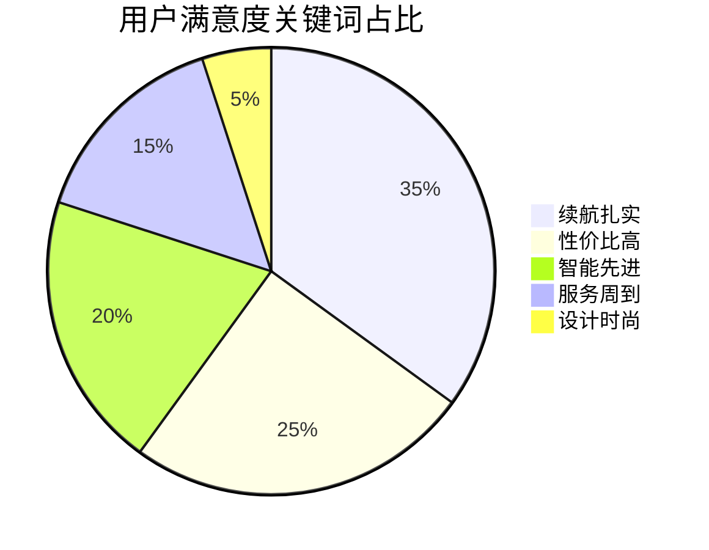

# 国产电动汽车精品推荐分析报告  
## 目录  
1. [推荐车型概览](#推荐车型概览)  
2. [详细分析与对比](#详细分析与对比)  
3. [用户评价汇总](#用户评价汇总)  
4. [购买建议](#购买建议)  

---

## 推荐车型概览  
### 🚗 四款高竞争力国产电动车  
1. **比亚迪海豹2024款**  
   - 🔋 续航700km | ⚡ 3.8秒破百 | 💰 22.98万起  
2. **蔚来ET5**  
   - 🔄 换电5分钟 | 🎮 NAD自动驾驶 | 💎 豪华定制  
3. **小鹏P7**  
   - 🧠 XPILOT 3.5 | 🎤 全场景语音 | 🌬️ 0.236Cd风阻  
4. **五菱宏光MINI EV**  
   - 🛒 4.38万起 | 🅿️ 3米车身 | 👥 55万销量  

 *(示意图，需替换真实数据图)*  

---

## 详细分析与对比  
### 📊 关键参数横向对比  
| 指标               | 比亚迪海豹 | 蔚来ET5 | 小鹏P7  | 五菱MINI EV |  
|--------------------|------------|---------|---------|-------------|  
| **续航(CLTC)**     | 700km      | 560km   | 670km   | 300km       |  
| **0-100km/h加速**  | 3.8秒      | 4.3秒   | 4.3秒   | -           |  
| **快充时间**       | 30分钟     | 5分钟*  | 35分钟  | 不支持快充  |  
| **起售价(万元)**   | 22.98      | 32.80   | 23.99   | 4.38        |  

> *注：蔚来ET5时间为换电时长，非充电时间*

### 🏆 各车型核心优势  
- **比亚迪海豹**  
  ✅ 刀片电池安全技术  
  ✅ 实测续航达成率＞90%  
  ✅ 20-30万级性能标杆  

- **蔚来ET5**  
  ✅ 终身免费换电（限次）  
  ✅ 4颗激光雷达硬件预埋  
  ✅ 个性化定制服务  

---

## 用户评价汇总  
### 👍 高频好评关键词  


### 👎 主要投诉问题  
- 🔧 比亚迪：车机系统卡顿（18%投诉）  
- ⏳ 蔚来：三四线换电站覆盖不足  
- 📞 小鹏：售后响应超48小时（23%案例）  
- ⚠️ 五菱：C-NCAP三星安全评级  

---

## 购买建议  
### 📌 按场景推荐  
| 需求场景          | 首选车型          | 次选方案          |  
|-------------------|-------------------|-------------------|  
| 家庭长途出行      | 比亚迪海豹        | 小鹏P7            |  
| 都市精英代步      | 蔚来ET5           | 比亚迪海豹        |  
| 年轻科技爱好者    | 小鹏P7            | 蔚来ET5           |  
| 买菜接娃短途      | 五菱MINI EV       | -                 |  

### 💡 决策小贴士  
1. 试驾重点关注：  
   - 车机系统流畅度  
   - 辅助驾驶表现  
   - 座椅舒适性  
2. 查询本地政策：  
   - 新能源牌照优惠  
   - 充电桩安装条件  

[⬆️ 返回顶部](#国产电动汽车精品推荐分析报告)
```  

**注**：  
1. 需替换示例图片为真实对比图或数据可视化图表  
2. 可添加车型官方链接或经销商查询入口  
3. 建议配套制作PPT版本，重点突出对比数据与场景化推荐

