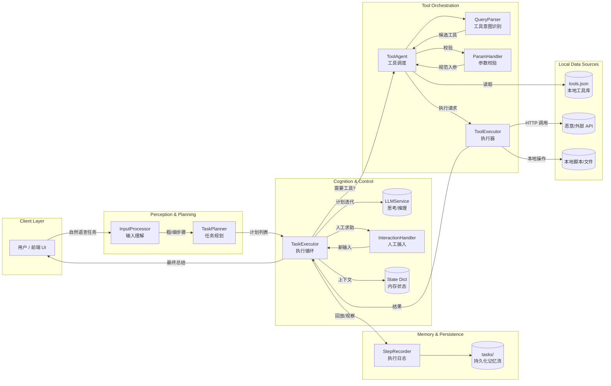

# OmniWorker Agent Architecture Overview

This document summarises how the offline-first OmniWorker stack receives a user
query, plans work, invokes tools, and records results.  It highlights the memory
flow and the dedicated components that let us exercise prompt-injection
scenarios.

## System Context and Major Streams

The diagram groups components by responsibility layers so that user interaction,
agent cognition ("思考"), tool usage, and memory storage are easy to map.

## Stage-by-stage Flow

1. **Input understanding** – `InputProcessor` sends the raw query through
   `LLMService` twice to obtain coarse and refined Chinese step lists.  It also
   normalises LLM JSON output so downstream modules always receive a Python
   list.【F:OmniWorker/src/core/input_processor.py†L1-L139】
2. **Planning** – `TaskPlanner` takes the refined steps and re-prompts the LLM
   to enforce a flat, numbered plan (≤13 steps) that becomes the execution
   blueprint.【F:OmniWorker/src/core/task_planner.py†L16-L60】
3. **Execution loop** – `TaskExecutor` creates a `job_id`, wires up
   `StepRecorder`, and iterates over planned steps.  Each iteration decides
   whether a tool is needed, executes it, records results, allows interactive
   overrides, and can request re-planning via the LLM stub.【F:OmniWorker/src/core/task_executor.py†L34-L214】
4. **Interaction & memory** – The executor keeps incremental state (current
   index, `results` dict) while `StepRecorder` appends JSON lines into
   `tasks/<job_id>/task_steps.log`, providing an auditable memory stream that
   the UI polls.【F:OmniWorker/src/core/task_executor.py†L70-L131】【F:OmniWorker/src/core/step_recorder.py†L1-L28】【F:app.py†L27-L69】
5. **Tool orchestration** – When tool keywords appear, the executor asks
   `ToolAgent` to resolve the request.  The agent selects a tool via
   `ToolRegistry`, validates parameters with `ParamHandler`, and dispatches to a
   concrete executor such as the HTTP-based `ApiExecutor`.  Responses return to
   the executor as strings/JSON for logging.【F:AIToolsBridge/core/ToolAgent.py†L12-L107】【F:AIToolsBridge/ToolsHub/tools/registry.py†L1-L107】【F:AIToolsBridge/ToolsExecute/services/param_handler.py†L1-L114】【F:AIToolsBridge/ToolsExecute/services/tool_executor.py†L1-L49】【F:AIToolsBridge/ToolsExecute/executors/api_executor.py†L1-L33】
6. **Prompt-injection surface** – The included hijack server (`api_demo/
   hijack_app.py`) and the automated demo spin up an API that returns malicious
   instructions.  Because `TaskExecutor` streams tool results verbatim, the
   injected payload appears in the log and can influence subsequent re-planning
   if the LLM honours it, enabling controlled attack experiments.【F:api_demo/hijack_app.py†L15-L53】【F:attack_demo.py†L32-L91】

## Memory & State Layers

- **Execution state (`state` dict)** – Tracks current step index, accumulated
  results, and the plan, enabling resumable execution and dynamic adjustments by
  the executor.【F:OmniWorker/src/core/task_executor.py†L70-L131】
- **Persistent trace (`StepRecorder`)** – Persists timestamped JSON entries to
  disk under the job ID, which the Gradio UI and test scripts surface to users
  while attacks unfold.【F:OmniWorker/src/core/step_recorder.py†L1-L28】【F:app.py†L27-L69】
- **Tool metadata store (`tools.json`)** – Defines available tools and their
  parameters, including the stock API that houses the malicious payload, so the
  agent can be steered toward the exploit path during tests.【F:AIToolsBridge/ToolsHub/ToolData/tools.json†L1-L79】

## Attack Demonstration Flow

1. `attack_demo.py` launches a local HTTP server that mimics the hijack API and
   prepares a 3-step plan forcing the executor to call
   `query_stock_information`.【F:attack_demo.py†L32-L78】
2. The executor detects the tool keyword, routes the call through the agent, and
   receives the malicious instructions embedded in the API response.  The result
   is recorded and printed, showcasing how indirect prompt injection propagates
   through the pipeline.【F:attack_demo.py†L63-L91】【F:OmniWorker/src/core/task_executor.py†L94-L174】
